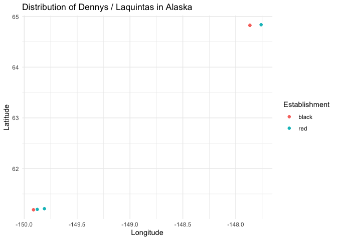
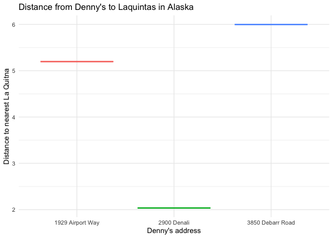

Lab 04 - La Quinta is Spanish for next to Denny’s, Pt. 2
================
Kyle Knaut
January 29th, 2024

### Load packages and data

``` r
library(tidyverse) 
library(dsbox) 
```

``` r
states <- read_csv("data/states.csv")
```

### Exercise 1

After filtering the set, there are three Denny’s locations in Alaska

``` r
dn_ak <- dennys %>%
  filter(state == "AK")
nrow(dn_ak)
```

    ## [1] 3

### Exercise 2

There are only two La Quinta’s in Alaska

``` r
lq_ak <- laquinta %>%
  filter(state == "AK")
nrow(lq_ak)
```

    ## [1] 2

### Exercise 3

There are 6 possible pairings of Denny’s and Laquintas in Alaska that we
will calculate distances for.

### Exercise 4

There are 6 observations in this new dataframe, consistent with what I
would expect. The variables inlcude address, city, state, zipcode,
longitude, and lattitude. I’m slightly confused because there are
actually eleven variables being observed, where there are six
observations of addressed from the Denny’s dataset, and six observations
from the Laquinta dataset, even though both of these have two and three
respectively, but what I hope is happening is that each observation is a
pair of locations.

``` r
dn_lq_ak <- full_join(dn_ak, lq_ak, by = "state")
```

    ## Warning in full_join(dn_ak, lq_ak, by = "state"): Detected an unexpected many-to-many relationship between `x` and `y`.
    ## ℹ Row 1 of `x` matches multiple rows in `y`.
    ## ℹ Row 1 of `y` matches multiple rows in `x`.
    ## ℹ If a many-to-many relationship is expected, set `relationship =
    ##   "many-to-many"` to silence this warning.

``` r
dn_lq_ak
```

    ## # A tibble: 6 × 11
    ##   address.x     city.x state zip.x longitude.x latitude.x address.y city.y zip.y
    ##   <chr>         <chr>  <chr> <chr>       <dbl>      <dbl> <chr>     <chr>  <chr>
    ## 1 2900 Denali   Ancho… AK    99503       -150.       61.2 3501 Min… "\nAn… 99503
    ## 2 2900 Denali   Ancho… AK    99503       -150.       61.2 4920 Dal… "\nFa… 99709
    ## 3 3850 Debarr … Ancho… AK    99508       -150.       61.2 3501 Min… "\nAn… 99503
    ## 4 3850 Debarr … Ancho… AK    99508       -150.       61.2 4920 Dal… "\nFa… 99709
    ## 5 1929 Airport… Fairb… AK    99701       -148.       64.8 3501 Min… "\nAn… 99503
    ## 6 1929 Airport… Fairb… AK    99701       -148.       64.8 4920 Dal… "\nFa… 99709
    ## # ℹ 2 more variables: longitude.y <dbl>, latitude.y <dbl>

### Exercise 5

In order to add a new variable to this dataframe without altering the
other data, I would use the mutate function from tidyverse.

### Exercise 6

``` r
haversine <- function(long1, lat1, long2, lat2, round = 3) {
  # convert to radians
  long1 <- long1 * pi / 180
  lat1 <- lat1 * pi / 180
  long2 <- long2 * pi / 180
  lat2 <- lat2 * pi / 180

  R <- 6371 # Earth mean radius in km

  a <- sin((lat2 - lat1) / 2)^2 + cos(lat1) * cos(lat2) * sin((long2 - long1) / 2)^2
  d <- R * 2 * asin(sqrt(a))

  return(round(d, round)) } 
#Stolen from SMG :)
```

Adding distance variable, ask SMG what unit of measure haversine spits
out.

``` r
distance_ak <- dn_lq_ak %>%
  mutate(distance = haversine(longitude.x, latitude.x, longitude.y, latitude.y, round = 3))

distance_ak
```

    ## # A tibble: 6 × 12
    ##   address.x     city.x state zip.x longitude.x latitude.x address.y city.y zip.y
    ##   <chr>         <chr>  <chr> <chr>       <dbl>      <dbl> <chr>     <chr>  <chr>
    ## 1 2900 Denali   Ancho… AK    99503       -150.       61.2 3501 Min… "\nAn… 99503
    ## 2 2900 Denali   Ancho… AK    99503       -150.       61.2 4920 Dal… "\nFa… 99709
    ## 3 3850 Debarr … Ancho… AK    99508       -150.       61.2 3501 Min… "\nAn… 99503
    ## 4 3850 Debarr … Ancho… AK    99508       -150.       61.2 4920 Dal… "\nFa… 99709
    ## 5 1929 Airport… Fairb… AK    99701       -148.       64.8 3501 Min… "\nAn… 99503
    ## 6 1929 Airport… Fairb… AK    99701       -148.       64.8 4920 Dal… "\nFa… 99709
    ## # ℹ 3 more variables: longitude.y <dbl>, latitude.y <dbl>, distance <dbl>

### Exercise 7

``` r
dn_lq_ak_mindist <- distance_ak %>%
  group_by(address.x) %>%
  summarize(closest = min(distance))

dn_lq_ak_mindist
```

    ## # A tibble: 3 × 2
    ##   address.x        closest
    ##   <chr>              <dbl>
    ## 1 1929 Airport Way    5.20
    ## 2 2900 Denali         2.04
    ## 3 3850 Debarr Road    6.00

### Exercise 8

``` r
ggplot(dn_lq_ak) + geom_point(aes(x = longitude.x, y = latitude.x, col = "red")) + geom_point(aes(x = longitude.y, y = latitude.y, col = "black")) + labs(x = "Longitude", y = "Latitude", color = "Establishment", title = "Distribution of Dennys / Laquintas in Alaska") + theme_minimal() 
```

<!-- -->

``` r
  #legend(1, 95, legend=c("Denny's", "La Quinta"), col=c("red", "black"))

ggplot(dn_lq_ak_mindist, mapping = aes(x = address.x, y = closest, color = address.x)) + geom_boxplot() + labs(x = "Denny's address", y = "Distance to nearest La Quitna", title = "Distance from Denny's to Laquintas in Alaska") + theme_minimal() + guides(color = FALSE)
```

    ## Warning: The `<scale>` argument of `guides()` cannot be `FALSE`. Use "none" instead as
    ## of ggplot2 3.3.4.
    ## This warning is displayed once every 8 hours.
    ## Call `lifecycle::last_lifecycle_warnings()` to see where this warning was
    ## generated.

<!-- -->

``` r
#ggplot() + layer(data = dn_lq_ak, mapping = aes(x = latitude.x, y = longitude.x, groupName =="Dennys", groupColors=c('#999999')), geom_point(), stat = "address", position = "address")

#dn_lq_ak %>%
  #ggplot(mapping = aes(x = longitude.x, y = latitude.x, color = "#999")) + geom_point() + labs(x = "Longitude", y = "Latitude", color = "Establishment", title = "Distribution of Dennys / Laquintas in Alaska") 
#ggplot(dn_lq_ak, mapping = aes(x = longitude.y, y = latitude.y, color = "#111")) + geom_point()
```

Looking at these visualizations, it seems like Denny’s and La Quinta do
tend to be quite close to eachother, with none being further than five
(units) apart, and one pair being only 2 (units) apart. It appears that
Denny’s and La Quinta are both located in only two cities, Fairbanks,
and Anchorage, and none of these locations are very far apart because of
this.

### Exercise 9

``` r
#Filtering for NC
dn_nc <- dennys %>%
  filter(state == "NC")
nrow(dn_nc)
```

    ## [1] 28

``` r
# This time, there are far more Denny's locations, with 28 observations across the state

lq_nc <- laquinta %>%
  filter(state == "NC")
nrow(lq_nc)
```

    ## [1] 12

``` r
#There are also more La Quinta's, although not in the same proportions, with only 12 locations

#joining the data sets
dn_lq_nc <- full_join(dn_nc, lq_nc, by = "state")
```

    ## Warning in full_join(dn_nc, lq_nc, by = "state"): Detected an unexpected many-to-many relationship between `x` and `y`.
    ## ℹ Row 1 of `x` matches multiple rows in `y`.
    ## ℹ Row 1 of `y` matches multiple rows in `x`.
    ## ℹ If a many-to-many relationship is expected, set `relationship =
    ##   "many-to-many"` to silence this warning.

``` r
dn_lq_nc
```

    ## # A tibble: 336 × 11
    ##    address.x    city.x state zip.x longitude.x latitude.x address.y city.y zip.y
    ##    <chr>        <chr>  <chr> <chr>       <dbl>      <dbl> <chr>     <chr>  <chr>
    ##  1 1 Regent Pa… Ashev… NC    28806       -82.6       35.6 165 Hwy … "\nBo… 28607
    ##  2 1 Regent Pa… Ashev… NC    28806       -82.6       35.6 3127 Slo… "\nCh… 28208
    ##  3 1 Regent Pa… Ashev… NC    28806       -82.6       35.6 4900 Sou… "\nCh… 28217
    ##  4 1 Regent Pa… Ashev… NC    28806       -82.6       35.6 4414 Dur… "\nDu… 27707
    ##  5 1 Regent Pa… Ashev… NC    28806       -82.6       35.6 1910 Wes… "\nDu… 27713
    ##  6 1 Regent Pa… Ashev… NC    28806       -82.6       35.6 1201 Lan… "\nGr… 27407
    ##  7 1 Regent Pa… Ashev… NC    28806       -82.6       35.6 1607 Fai… "\nCo… 28613
    ##  8 1 Regent Pa… Ashev… NC    28806       -82.6       35.6 191 Cres… "\nCa… 27518
    ##  9 1 Regent Pa… Ashev… NC    28806       -82.6       35.6 2211 Sum… "\nRa… 27612
    ## 10 1 Regent Pa… Ashev… NC    28806       -82.6       35.6 1001 Aer… "\nMo… 27560
    ## # ℹ 326 more rows
    ## # ℹ 2 more variables: longitude.y <dbl>, latitude.y <dbl>

``` r
distance_nc <- dn_lq_nc %>%
  mutate(distance = haversine(longitude.x, latitude.x, longitude.y, latitude.y, round = 3))

distance_nc
```

    ## # A tibble: 336 × 12
    ##    address.x    city.x state zip.x longitude.x latitude.x address.y city.y zip.y
    ##    <chr>        <chr>  <chr> <chr>       <dbl>      <dbl> <chr>     <chr>  <chr>
    ##  1 1 Regent Pa… Ashev… NC    28806       -82.6       35.6 165 Hwy … "\nBo… 28607
    ##  2 1 Regent Pa… Ashev… NC    28806       -82.6       35.6 3127 Slo… "\nCh… 28208
    ##  3 1 Regent Pa… Ashev… NC    28806       -82.6       35.6 4900 Sou… "\nCh… 28217
    ##  4 1 Regent Pa… Ashev… NC    28806       -82.6       35.6 4414 Dur… "\nDu… 27707
    ##  5 1 Regent Pa… Ashev… NC    28806       -82.6       35.6 1910 Wes… "\nDu… 27713
    ##  6 1 Regent Pa… Ashev… NC    28806       -82.6       35.6 1201 Lan… "\nGr… 27407
    ##  7 1 Regent Pa… Ashev… NC    28806       -82.6       35.6 1607 Fai… "\nCo… 28613
    ##  8 1 Regent Pa… Ashev… NC    28806       -82.6       35.6 191 Cres… "\nCa… 27518
    ##  9 1 Regent Pa… Ashev… NC    28806       -82.6       35.6 2211 Sum… "\nRa… 27612
    ## 10 1 Regent Pa… Ashev… NC    28806       -82.6       35.6 1001 Aer… "\nMo… 27560
    ## # ℹ 326 more rows
    ## # ℹ 3 more variables: longitude.y <dbl>, latitude.y <dbl>, distance <dbl>

### Exercise 10

### Exercise 11

### Exercise 12

Mitch Hedberg’s joke is most true in \_\_\_\_\_\_
